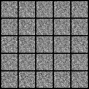
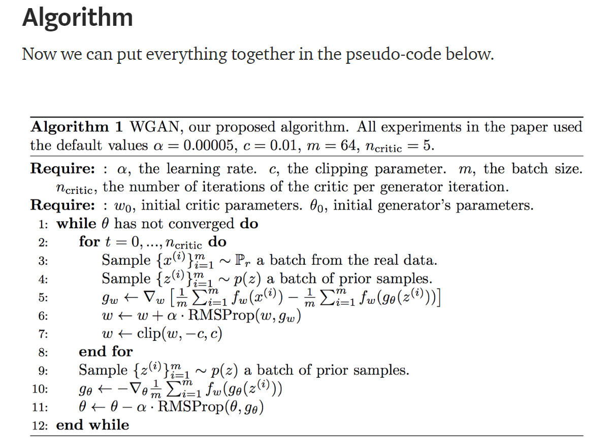

# Wasserstein GAN

The Wasserstein Generative Adversarial Network, or Wasserstein GAN, is an extension to the generative adversarial network that both improves the stability when training the model and provides a loss function that correlates with the quality of generated images. It uses a gradient penalty at the discriminator which is backpropagated across the network. The essence of the gradient penalty and wassertein distance is to avoid mode collapse.

## Network Architecture

